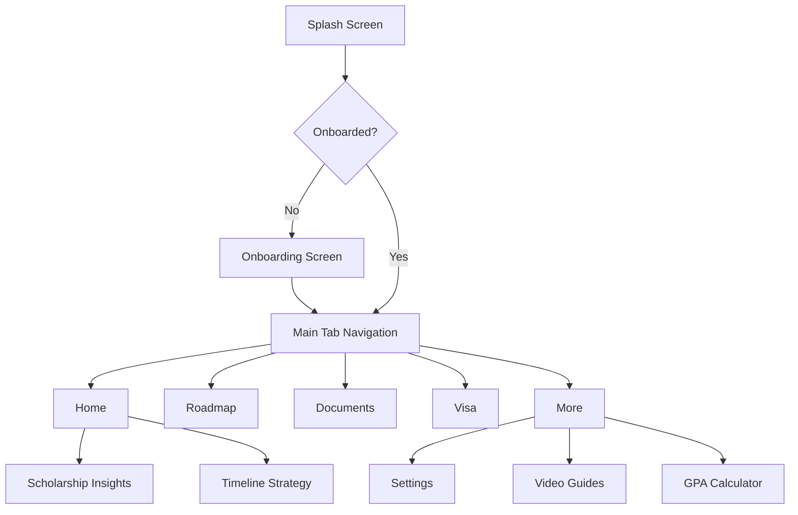

# 🎓 Zemen Scholar


> **Empowering students to achieve their global education dreams.** 

Zemen Scholar is a comprehensive mobile application built with React Native and Expo. It provides a structured roadmap, resources, and tools to guide students through the complex process of applying for scholarships and studying abroad.

---

## ✨ Key Features

- 🗺️ **Interactive Roadmap**: Step-by-step guidance through the application journey.
- 🛂 **Visa Guide**: Detailed QA and embassy preparation for visa applications.
- 📄 **Documents Hub**: Templates and guides for personal statements, CVs, and recommendations.
- 📊 **GPA Calculator**: Built-in tool to track academic performance.
- 💡 **Scholarship Insights**: Curated tips and strategies to win scholarships.
- 📅 **Timeline Strategy**: Organization tools to keep deadlines in check.
- 🌟 **Extracurricular Tracker**: Guide to building a strong profile.

---

## 🛠️ Tech Stack

- **Frontend**: React Native, Expo, TypeScript
- **State Management**: React Context API
- **Backend/BaaS**: Supabase (Database, Auth)
- **Styling**: Custom Theme Provider
- **Icons**: Lucide React Native

---

## 🚀 Getting Started

### Prerequisites

- Node.js (v18 or newer)
- npm or yarn
- Expo CLI
- iOS Simulator or Android Emulator (or a physical device with Expo Go)

### Installation

1. **Clone the repository:**
   ```bash
   git clone https://github.com/your-username/zemen-scholar.git
   cd zemen-scholar
   ```

2. **Install dependencies:**
   ```bash
   npm install
   ```

3. **Set up environment variables:**
   Create a `.env` file in the root directory and add your Supabase credentials:
   ```env
   EXPO_PUBLIC_SUPABASE_URL=your_supabase_url
   EXPO_PUBLIC_SUPABASE_ANON_KEY=your_supabase_anon_key
   ```

4. **Run the app:**
   ```bash
   npx expo start
   ```

---

## 🏗️ Architecture & Navigation Flow

The app follows a structured tab-based navigation with nested screens for deep content.



---

## 📁 Project Structure

```text
zemen-scholar/
├── src/
│   ├── assets/        # Images, fonts, and icons
│   ├── components/    # Reusable UI components
│   ├── constants/     # App-wide constants
│   ├── context/       # Global state management
│   ├── hooks/         # Custom React hooks
│   ├── navigation/    # Tab and Stack navigators
│   ├── screens/       # Main screen components
│   ├── services/      # API and backend integrations
│   ├── storage/       # Local storage utilities
│   ├── theme/         # Design system and styling
│   ├── types/         # TypeScript definitions
│   └── utils/         # Helper functions
├── supabase/          # Backend configuration and migrations
├── App.tsx            # Application entry point
├── app.json           # Expo configuration
└── package.json       # Project metadata and dependencies
```

---

## 🤝 Contributing

We welcome contributions! Please follow these steps:
1. Fork the project
2. Create your feature branch (`git checkout -b feature/AmazingFeature`)
3. Commit your changes (`git commit -m 'Add some AmazingFeature'`)
4. Push to the branch (`git push origin feature/AmazingFeature`)
5. Open a Pull Request

---

## 📜 License

Distributed under the MIT License. See `LICENSE` for more information.
